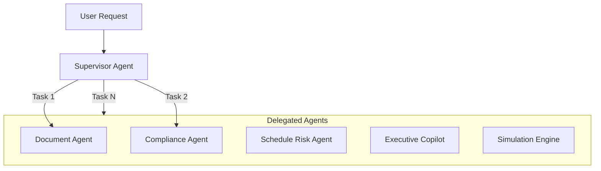
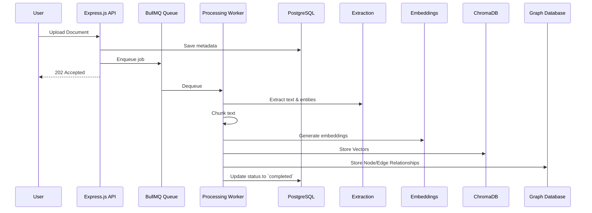
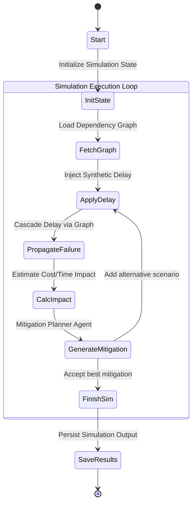

# AI Pipelines and Data Flows

## Supervisor Orchestration

```mermaid
graph TD
    UserQuery["User Request"] --> Supervisor["Supervisor Agent"]
    
    subgraph Agents ["Delegated Agents"]
        DocAgent["Document Agent"]
        CompAgent["Compliance Agent"]
        SchedAgent["Schedule Risk Agent"]
        ExecAgent["Executive Copilot"]
        SimAgent["Simulation Engine"]
    end
    
    Supervisor -->|Task 1| DocAgent
    Supervisor -->|Task 2| CompAgent
    Supervisor -->|Task N| Agents
```

## Document Processing & Graph Indexing Pipeline

```mermaid
sequenceDiagram
    participant User
    participant API as Express.js API
    participant BullMQ as BullMQ Queue
    participant Worker as Processing Worker
    participant DB as PostgreSQL
    participant Extract as Extraction
    participant Embed as Embeddings
    participant VectorDB as ChromaDB
    participant GraphDB as Graph Database

    User->>API: Upload Document
    API->>DB: Save metadata
    API->>BullMQ: Enqueue job
    API-->>User: 202 Accepted

    BullMQ->>Worker: Dequeue
    Worker->>Extract: Extract text & entities
    Worker->>Worker: Chunk text
    Worker->>Embed: Generate embeddings
    Worker->>VectorDB: Store Vectors
    Worker->>GraphDB: Store Node/Edge Relationships
    Worker->>DB: Update status to `completed`
```

## Simulation & Failure Propagation Pipeline

```mermaid
stateDiagram-v2
    [*] --> Start
    Start --> InitState: Initialize Simulation State
    
    state "Simulation Execution Loop" as SimLoop {
        InitState --> FetchGraph: Load Dependency Graph
        FetchGraph --> ApplyDelay: Inject Synthetic Delay
        ApplyDelay --> PropagateFailure: Cascade Delay via Graph
        PropagateFailure --> CalcImpact: Estimate Cost/Time Impact
        CalcImpact --> GenerateMitigation: Mitigation Planner Agent
        
        GenerateMitigation --> ApplyDelay: Add alternative scenario
        GenerateMitigation --> FinishSim: Accept best mitigation
    }
    
    FinishSim --> SaveResults: Persist Simulation Output
    SaveResults --> [*]
```
