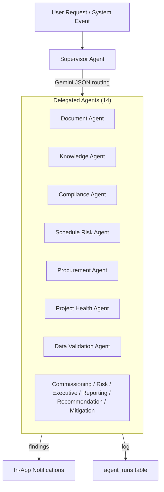
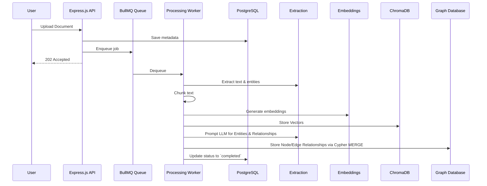
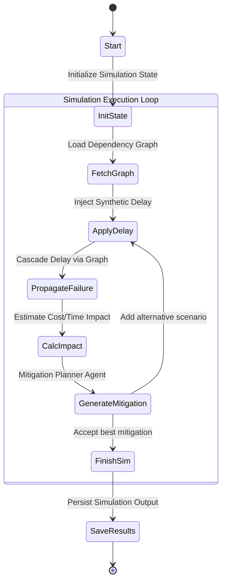

# AI Pipelines and Data Flows

## Supervisor Orchestration

## Agent Auto-Trigger Events
| Event | Triggered Agents |
|-------|------------------|
| Document processed | DOCUMENT, DATA_VALIDATION |
| Schedule imported | SCHEDULE_RISK, PROJECT_HEALTH |
| Procurement imported | PROCUREMENT, PROJECT_HEALTH |

Agents execute via BullMQ `agent-execution` queue. Manual triggers available via `POST /agents/{type}/run`.

## Document Processing & Graph Indexing Pipeline

## Simulation & Failure Propagation Pipeline

