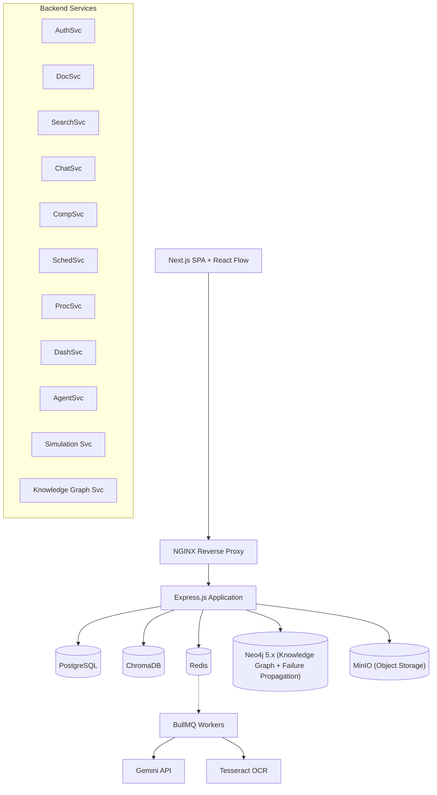
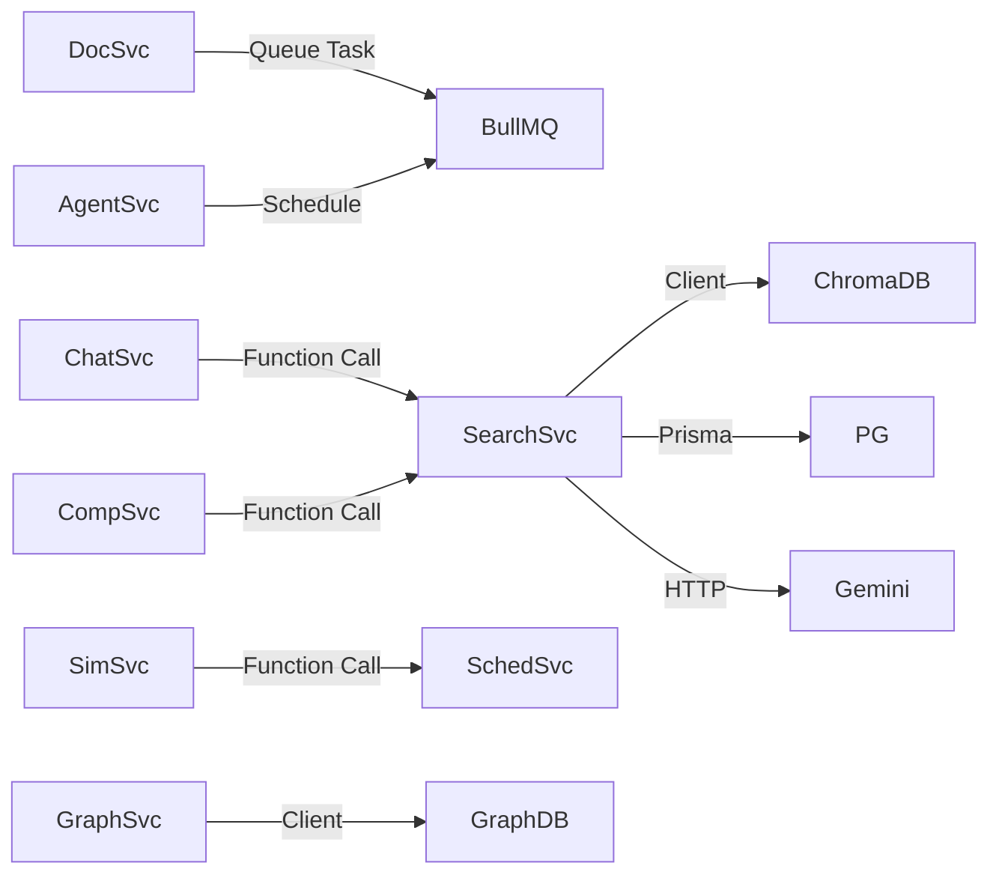

# System Architecture

## Architecture Style
DCBrain uses a **neuro-symbolic modular monolith** architecture. It combines AI models (Gemini) for unstructured data extraction and natural language reasoning with a deterministic mathematical engine (Neo4j) for graph-based failure simulation and schedule math.

## High-Level Architecture

## Module Communication

## Security
JWT validation, RBAC, HTTPS termination at NGINX, Input validation via Zod.

## Scaling Strategy
Horizontal API scaling, worker scaling via BullMQ, DB read replicas, event-driven event bus.
