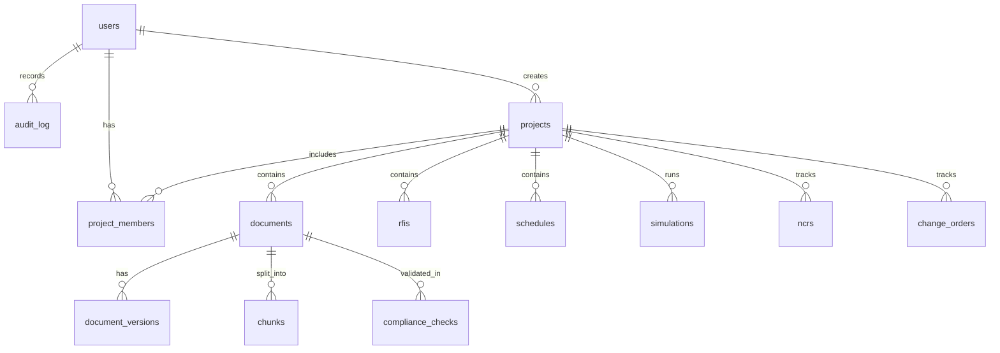

# Database Design

**Engine:** PostgreSQL 16.x (Relational/JSON/Full-text), ChromaDB (Vector embeddings), MinIO (Object/File Storage), and **Neo4j 5.x** (Graph DB for Node/Edge tracking, Knowledge Graph, and Failure Propagation). See [DECISIONS.md](./DECISIONS.md) ADR-010.

## Schema Overview

## Expected Tables
- `users`, `projects`, `project_members`, `documents`, `document_versions`, `chunks`
- `chat_sessions`, `chat_messages`: Created in Task 006 for Project Chat.
- `rfis`: Requests for Information tracking.
- `compliance_checks`: Validation results.
- `schedule_activities`: P6 imported activities.
- `procurement_items`, `vendors`: POs, statuses, vendor scoring.
- `audit_log`, `agent_runs`, `agent_schedules`, `notifications`, `reports`, `notification_preferences`
- **NEW:** `simulations` (What-if scenario tracking)
- **NEW:** `ncrs` (Non-Conformance Reports)
- **NEW:** `change_orders` (Project financial/scope changes)

### Reports

- `reports` stores generated project reports with `type` (DAILY, WEEKLY, EXECUTIVE, COMPLIANCE, RISK, PROCUREMENT), `status` (PENDING, GENERATING, COMPLETED, FAILED), `title`, `markdownContent` (full Markdown), `storageKey` (MinIO PDF object key), `fileSizeBytes`, `error`, `metadata` (JSON with health score, section count, etc.), `generatedAt`, FK links to `projects` and optional `users` (generatedBy).
- Migration: `20260715100000_add_reports`.

### Audit Log

- `audit_log` stores auth events, RBAC-sensitive actions, and other notable user activity.
- Columns include `action`, `resourceType`, `resourceId`, `details`, `ipAddress`, `userAgent`, `createdAt`, and optional `userId`.

### Documents

- `documents` stores uploaded file metadata, MinIO bucket/path, project/owner links, category, processing status, timestamps, and `deletedAt` for soft delete.
- New uploads start at `DocumentStatus.QUEUED`; Task 004 is responsible for moving documents through processing/completed/failed states.
- `document_versions` stores immutable raw-file snapshots for each document version. Task 003 creates version `1` during initial upload.
- MinIO object keys are project-scoped and UUID-based: `projects/{projectId}/documents/{uuid}/{sanitizedFilename}`.

### Requests for Information (RFIs)

- `rfis` stores project-scoped Requests for Information (RFIs) with project-specific sequential numbers (e.g. `RFI-0001`). It records the subject, question, priority (LOW to CRITICAL), status (OPEN to VOID), discipline, due date, official resolution, and AI suggested response with sources. It maintains FK links to `projects` and `users` (raisedBy, assignee, answeredBy).
- `rfi_documents` is a junction table linking RFIs to project documents.

### Agent Runs & Schedules

- `agent_runs` logs every agent execution with `agentType`, `status` (PENDING/RUNNING/COMPLETED/FAILED), `input`/`output` JSON, `durationMs`, `costEstimate`, `projectId`, and optional `triggeredById`.
- `agent_schedules` stores per-project cron expressions for repeatable agent runs. Unique constraint on `(projectId, agentType)`.
- `notifications` stores in-app alerts surfaced when agents or background pipelines produce findings (type, title, message, link, data JSON, read status).
- `notification_preferences` records user configurations for in-app and email digests.

## Vector Store (ChromaDB)
- `project_{id}_documents`: Document chunk embeddings.
- `project_{id}_standards`: Industry standard embeddings.

## Knowledge Graph (Neo4j)
- **Node Labels**: `Document`, `Chunk`, `Equipment`, `Vendor`, `Standard`, `Activity`, `DocumentReference`.
- **Relationships**: 
  - `(Document)-[:CONTAINS]->(Chunk)`
  - `(Chunk)-[:MENTIONS]->(Entity)`
  - Entity-to-Entity: `[:REFERENCES]`, `[:SUPPLIES]`, `[:DEPENDS_ON]`, `[:GOVERNS]`
- **Constraints**: Name/ID uniqueness enforced for entity types EXCEPT `Activity` (Activity names are not globally unique to allow multi-schedule uploads without conflicts).

### 14. `reports`
- Project-scoped reporting artifacts (Daily, Weekly, Exec, Risk, Compliance).
- Ties directly into MinIO storage via `storageKey`.

### 15. `simulations`
- `id`, `name`, `targetActivityId`, `delayDays`, `status`
- Stores results of what-if scenario simulations.
- `impacts` JSON tracks downstream entities affected.
- `mitigationPlans` JSON stores strategies returned by MitigationPlannerAgent.
- `costImpact` and `timeImpactDays` represent high-level project exposure.

## Object Storage (MinIO)
- Secure, S3-compatible storage for uploaded PDFs, Images, DOCX, and Excel files.

### 16. `notification_preferences`
- User-scoped notification settings (`userId` @unique, `inApp` boolean default true, `emailDigest` boolean default false, timestamps).
- Ties directly into `users` table.
