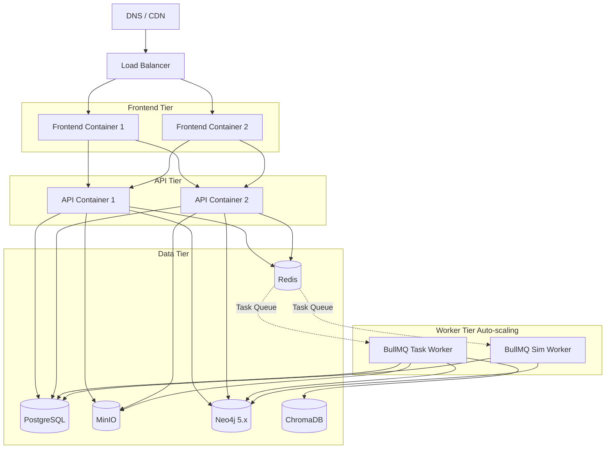

# Deployment

## Environments
- **Local:** `localhost:3000` (frontend), `localhost:8000` (API)
- **Staging:** `staging.dcbrain.example.com` (`develop` branch)
- **Production:** `dcbrain.example.com` (`main` branch)

## Quick Start
Run `docker compose up -d` to spin up frontend, backend, worker, postgres, redis, chromadb, minio, and graph db.

## Production Architecture

