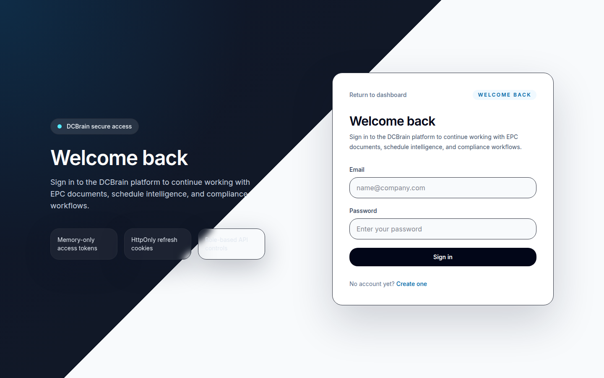
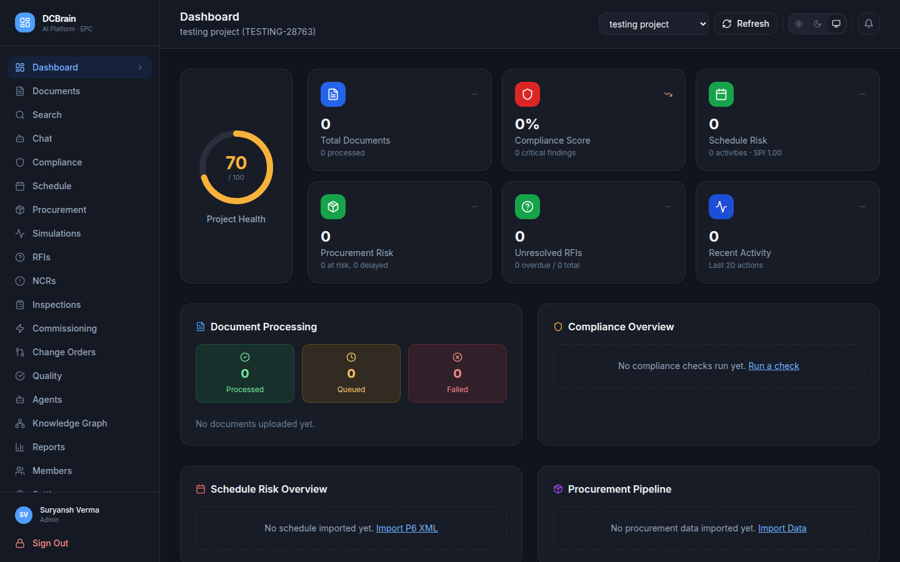
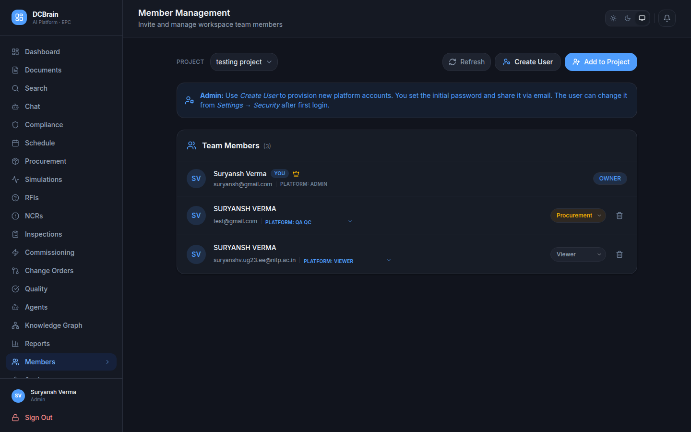
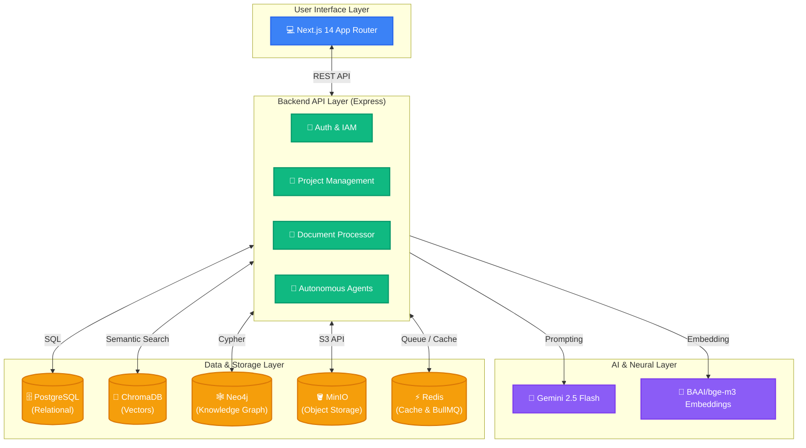

# 🧠 DCBrain: AI Platform for Data Centre EPC 🏗️

DCBrain is an AI-powered platform that unifies EPC (Engineering, Procurement, Construction) project data for data centre projects. It combines RAG document search, Knowledge Graph, automated compliance checking, schedule risk prediction, and an ensemble of autonomous AI agents.

## 🌐 Live Demo
**Access the platform here:** [https://dcbrain.nebula-hack.tech](https://dcbrain.nebula-hack.tech)

---

## 📸 Platform Showcase

### 🔐 Login & Security
- **IAM-Style User Provisioning:** Highly secure environment where the platform Admin creates and provisions accounts. 
- **Role-Based Access Control:** Distinct Global Platform Roles (Admin vs Viewer) and isolated Workspace Project Roles (Manager, Engineer, QA/QC, Procurement).
- **Self-Service Security:** Users can securely change their passwords upon first login.


### 🏠 Home Page & Dashboard
- **Centralized Project Hub:** A unified view of all active Data Centre construction projects.
- **Project Isolation:** Complete multi-tenant data isolation ensuring documents, members, and activities are strictly siloed per workspace.


### 👥 Member Management
- **Invite System:** Easily invite existing platform users into specific workspaces.
- **Granular Permissions:** Manage access levels for each team member instantly with a clean UI.


---

## 🚀 Quick Start

### Prerequisites
- 🐳 Docker 24.x + Docker Compose 2.x
- 🟢 Node.js 20.x (for local development without Docker)
- 🔑 Google Gemini API key (for AI features)

### 1. Clone and Configure
```bash
git clone https://github.com/your-org/dcbrain.git
cd dcbrain

# Copy environment template
cp .env.example .env

# Edit .env and add your GEMINI_API_KEY
```

### 2. Start All Services
```bash
docker compose up -d
```
This starts 8 core services including the Next.js Frontend, Express Backend, PostgreSQL, Redis, ChromaDB, MinIO, Neo4j, and BullMQ workers.

### 3. Verify Installation
```bash
# Check all services are running
docker compose ps
```

### 4. Run Database Migrations & Bootstrap
```bash
docker compose exec backend npx prisma migrate dev --name init
```
*Note: Upon starting, the backend will automatically provision an initial Admin user if one does not exist, using credentials defined in your `backend/app.env` (`INITIAL_ADMIN_EMAIL`, `INITIAL_ADMIN_PASSWORD`).*

---

## 🏗️ Architecture & Tech Stack

DCBrain uses a **neuro-symbolic modular monolith**:
- **🧠 AI Layer**: Gemini 2.5 Flash for reasoning, BAAI/bge-m3 for embeddings
- **🕸️ Symbolic Layer**: Neo4j for failure propagation graphs, mathematical schedule simulation
- **🗄️ Data Layer**: PostgreSQL (relational), ChromaDB (vectors), MinIO (objects), Redis (cache/queue)
- **💻 Frontend**: Next.js 14 App Router, Redux Toolkit, TailwindCSS, shadcn/ui



---

## 🧪 Core Features

1. **🔍 RAG Document Search** - Semantic + keyword search with citations
2. **🕸️ Knowledge Graph** - Cross-document entity linking, failure propagation
3. **✅ Compliance Validation** - Automated ASHRAE, NFPA, IEC checking
4. **⏱️ Schedule Intelligence** - Risk prediction, delay simulation, what-if scenarios
5. **📦 Procurement Visibility** - BOQ, RFI, NCR, Change Orders, Inspection tracking
6. **🤖 14 Autonomous AI Agents** - Supervisor, Document, Compliance, Schedule, etc.

---

## 📡 API Usage & Documentation

DCBrain exposes a RESTful API over port `8000` (or port `9020` when running via `docker-compose.prod.test.yml`). Below are key endpoints for interacting with the core AI and management services.

### 1. Authentication (`/api/v1/auth`)
Obtain a JSON Web Token (JWT) by authenticating with your credentials:
```bash
curl -X POST http://localhost:8000/api/v1/auth/login \
  -H "Content-Type: application/json" \
  -d '{
    "email": "suryansh@gmail.com",
    "password": "testadminpassword"
  }'
```
*Response returns `{ "accessToken": "eyJ...", "refreshToken": "..." }`.*

### 2. AI Chat & RAG Queries (`/api/v1/projects/:projectId/chat`)
Engage with **DCBrain** (powered by LangGraph and `gemma-4-31b-it`) to search project documents or retrieve expert Data Centre EPC answers:
```bash
# Send a prompt to an active chat session
curl -X POST http://localhost:8000/api/v1/projects/YOUR_PROJECT_ID/chat/sessions/YOUR_SESSION_ID/messages \
  -H "Authorization: Bearer YOUR_ACCESS_TOKEN" \
  -H "Content-Type: application/json" \
  -d '{
    "content": "Give me a 3-row comparison table of ASHRAE 90.4 vs NFPA 75 requirements for data centres."
  }'
```

### 3. AI Compliance Engine (`/api/v1/projects/:projectId/compliance`)
Run automated compliance checks against Data Centre engineering standards (`ASHRAE`, `NFPA`, `TIA-942`, `Uptime Institute`):
```bash
curl -X POST http://localhost:8000/api/v1/projects/YOUR_PROJECT_ID/compliance/run-audit \
  -H "Authorization: Bearer YOUR_ACCESS_TOKEN" \
  -H "Content-Type: application/json"
```

### 4. Schedule Risk Simulations & AI Mitigations (`/api/v1/projects/:projectId/simulations`)
Simulate delay cascades across construction schedules and generate AI engineering mitigation strategies:
```bash
# Trigger AI Mitigation Plan generation for a completed delay simulation
curl -X POST http://localhost:8000/api/v1/projects/YOUR_PROJECT_ID/simulations/YOUR_SIMULATION_ID/generate-mitigation \
  -H "Authorization: Bearer YOUR_ACCESS_TOKEN" \
  -H "Content-Type: application/json"
```

---

## 🔒 Security

- 🎫 JWT authentication with refresh tokens
- 🛡️ Strict RBAC (Role-Based Access Control)
- 🪖 Helmet.js security headers
- 🌐 CORS configured for frontend origin
- 📝 Input validation via Zod schemas

---

## 🤝 Contributing & License
**Built for ET AI Hackathon 2026** 🏆 Team Nebula  
Proprietary License.