# DCBrain


An AI-powered platform unifying Data Centre EPC (Engineering, Procurement, Construction) project data using Hybrid RAG, a deterministic Knowledge Graph, automated compliance checking against standards, schedule risk prediction, failure simulation, and an ensemble of autonomous AI agents.


## Table of Contents
- [Problem Statement](#problem-statement)
- [Solution Overview](#solution-overview)
- [Key Features](#key-features)
- [System Architecture](#system-architecture)
- [AI Architecture](#ai-architecture)
- [AI Workflow](#ai-workflow)
- [Application Modules](#application-modules)
- [Architecture Diagrams](#architecture-diagrams)
- [Application Walkthrough (Screenshots)](#application-walkthrough-screenshots)
- [Tech Stack](#tech-stack)
- [Folder Structure](#folder-structure)
- [Installation](#installation)
- [Docker](#docker)
- [Deployment](#deployment)
- [Project Workflow](#project-workflow)
- [Design Decisions](#design-decisions)
- [Roadmap](#roadmap)
- [Contributors](#contributors)
- [License](#license)

## Problem Statement

Data Centre EPC projects suffer from severe information fragmentation, compliance blind spots, schedule opacity, and knowledge loss. Project Managers, Design Engineers, and Construction Managers constantly struggle to reconcile disorganized document repositories, unstructured emails, disconnected scheduling tools, and disjointed procurement trackers. This results in costly delays, cascading failures, and compliance breaches.

## Solution Overview

DCBrain is a **neuro-symbolic modular monolith** platform designed to unify all EPC project data. By combining probabilistic AI models (Gemini) for unstructured data extraction and natural language reasoning with a deterministic mathematical engine (Neo4j) for graph-based failure simulation and schedule math, DCBrain provides real-time intelligence, proactive risk mitigation, and seamless project management.

## Key Features

- **RAG-Powered Document Search:** Natural language search across all project documents using a hybrid approach (semantic + keyword).
- **Knowledge Graph & Failure Simulator:** Deterministic Neo4j graph tracking equipment, vendor, and task dependencies. Calculates delay and failure propagation using PRISM math models.
- **Automated Compliance Validation:** AI-driven compliance checking of specifications against industry standards like ASHRAE, NFPA, and TIA-942.
- **Schedule Risk Prediction:** Advanced math models simulating schedule slips and critical path delays with Monte Carlo simulations.
- **Procurement Visibility:** Centralized pipeline tracking material status, vendor performance, and lead times.
- **Comprehensive EPC Intelligence:** Seamless management of RFIs, NCRs, Change Orders, Inspections, and Commissioning.
- **Autonomous AI Agents:** An ensemble of 14 delegated agents (Supervisor, Document, Compliance, Schedule, etc.) proactively auditing project health and generating mitigation plans.
- **Automated Report Generation:** Asynchronous generation of executive, compliance, and risk reports exported to PDF.

## System Architecture

DCBrain uses a robust architecture tailored for AI workloads and data-intensive operations.

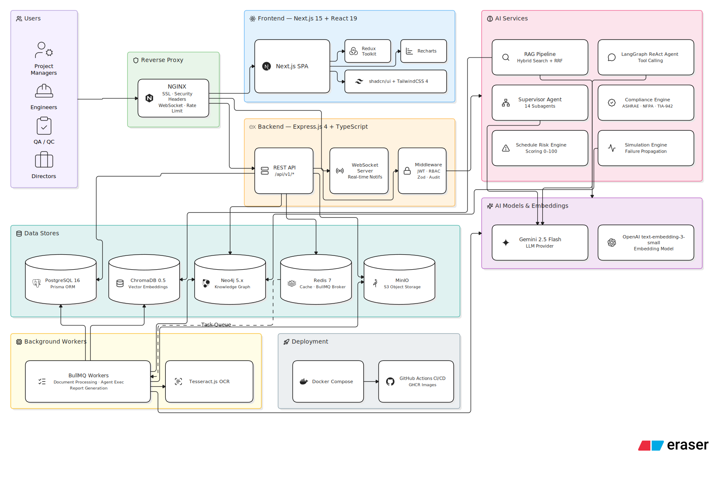

The Next.js frontend communicates with an Express.js REST/WebSocket API. Backend services coordinate via a PostgreSQL operational database, ChromaDB for vectors, Neo4j for the knowledge graph, MinIO for object storage, and Redis/BullMQ for asynchronous task processing.

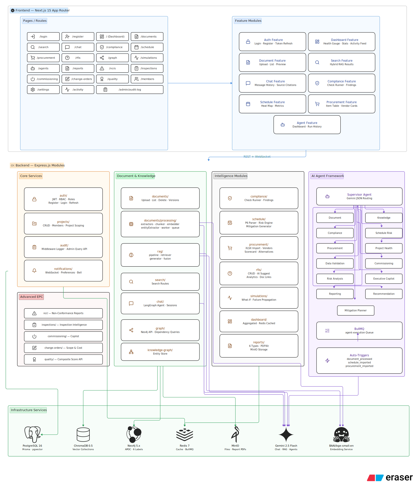

## AI Architecture

- **Hybrid RAG:** Combines Dense Vector Search (ChromaDB + OpenAI Embeddings) with Sparse Keyword Search (BM25) for precision.
- **Knowledge Graph:** Neo4j stores deterministic entities (Equipment, Tasks, Vendors) and relationships for complex multi-hop reasoning.
- **Embeddings & Vector Search:** `text-embedding-3-small` creates 1536-dimensional vectors for documents and chunks.
- **Multi-Agent System:** A LangGraph-powered Supervisor Agent orchestrates 14 specialized worker agents, dynamically delegating tasks.
- **Grounded Generation & Citation Engine:** Gemini 2.5 Flash produces answers grounded strictly in retrieved chunks, appending exact page and document citations.

## AI Workflow

`Upload` ➔ `OCR` ➔ `Chunking` ➔ `Embeddings` ➔ `Vector Search` ➔ `Hybrid Retrieval` ➔ `Knowledge Graph` ➔ `Gemini` ➔ `Grounded Answer`

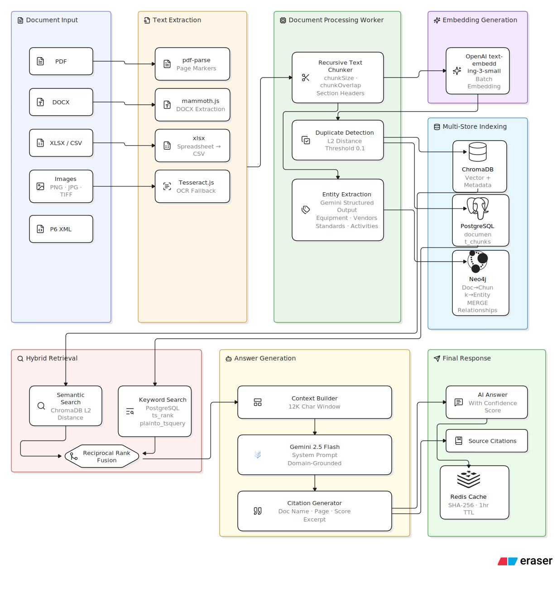

## Application Modules

- **Dashboard:** Visual telemetry of project health, dependency graphs, schedule risks, and compliance metrics.
- **Documents:** Batch upload, processing pipeline tracking, and version-controlled document repository.
- **Search:** Hybrid RAG search engine across all EPC documentation.
- **Chat:** Conversational AI interface with session history, citations, and context awareness.
- **Compliance:** Automated standard checking (e.g., ASHRAE) against uploaded design specifications.
- **Schedule:** P6 XML imports, critical path views, and schedule risk heat maps.
- **Procurement:** Vendor scorecards, status pipelines, and lead-time tracking.
- **Simulation:** Delay propagation timelines and AI-generated mitigation cards.
- **RFI:** Request for Information management with AI-suggested answers.
- **Inspection:** Quality assurance tracking and evidence management.
- **NCR:** Non-Conformance Report logging and resolution workflows.
- **Commissioning:** Start-up tracking and handover documentation.
- **Knowledge Graph:** Interactive React Flow visualization of project entities.
- **Reports:** Synchronous and asynchronous automated reporting (PDF generation).
- **Agents:** Dashboard monitoring the activity and findings of the 14 autonomous AI agents.

## Architecture Diagrams

Here is a collection of all system blueprints and pipeline flows defining DCBrain:

### AI Chat Flow
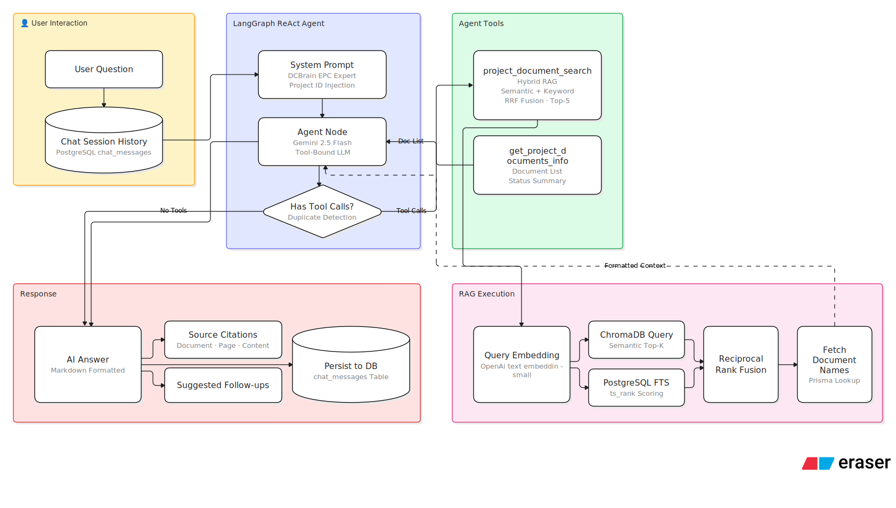

### Compliance Engine
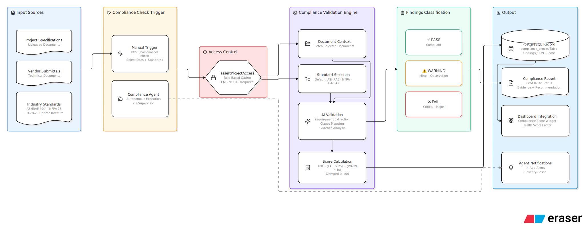

### Document Processing Pipeline
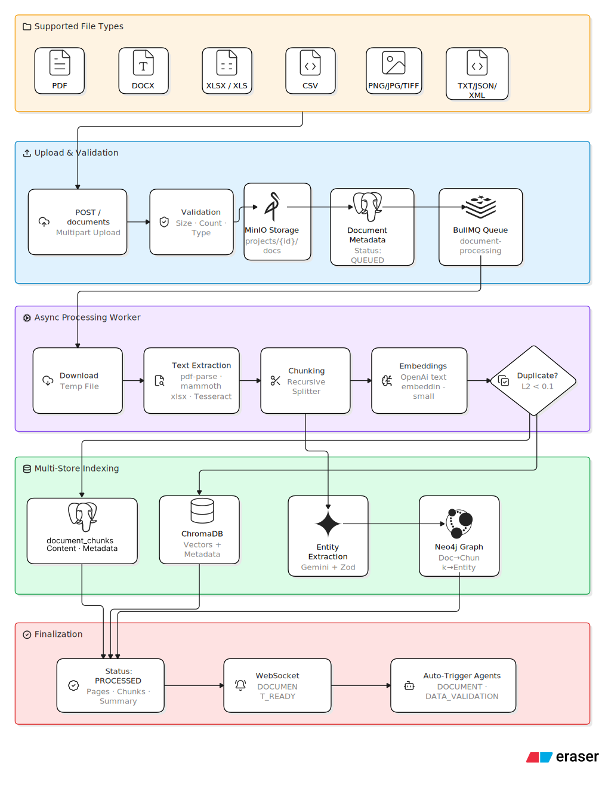

### Multi-Source Document RAG Pipeline
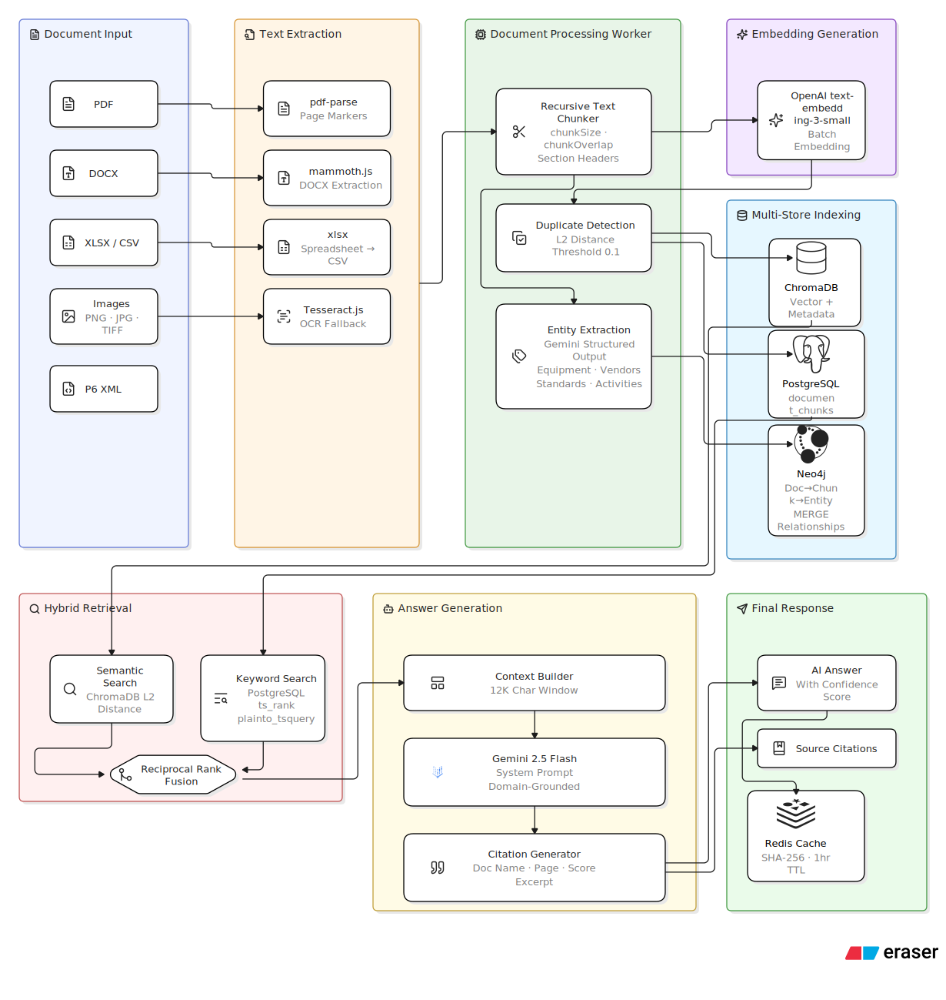

### Procurement Intelligence Flow
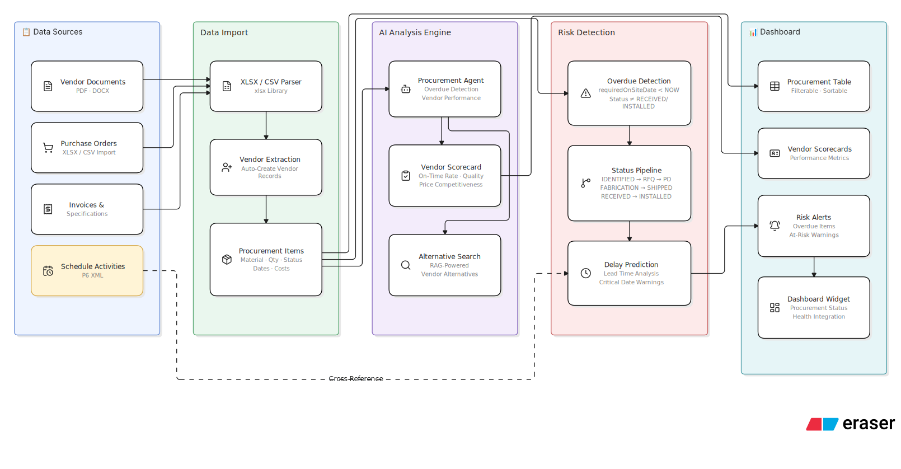

### RAG System Architecture
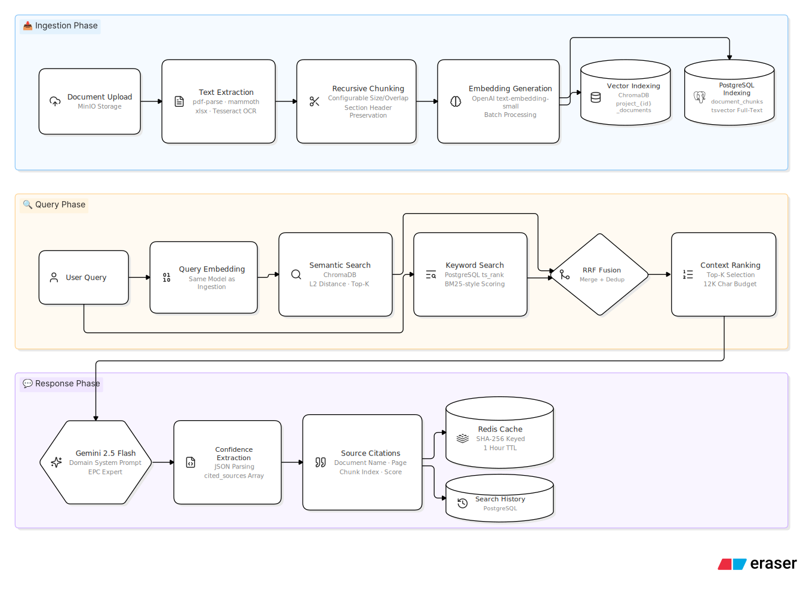

### Schedule Risk Pipeline
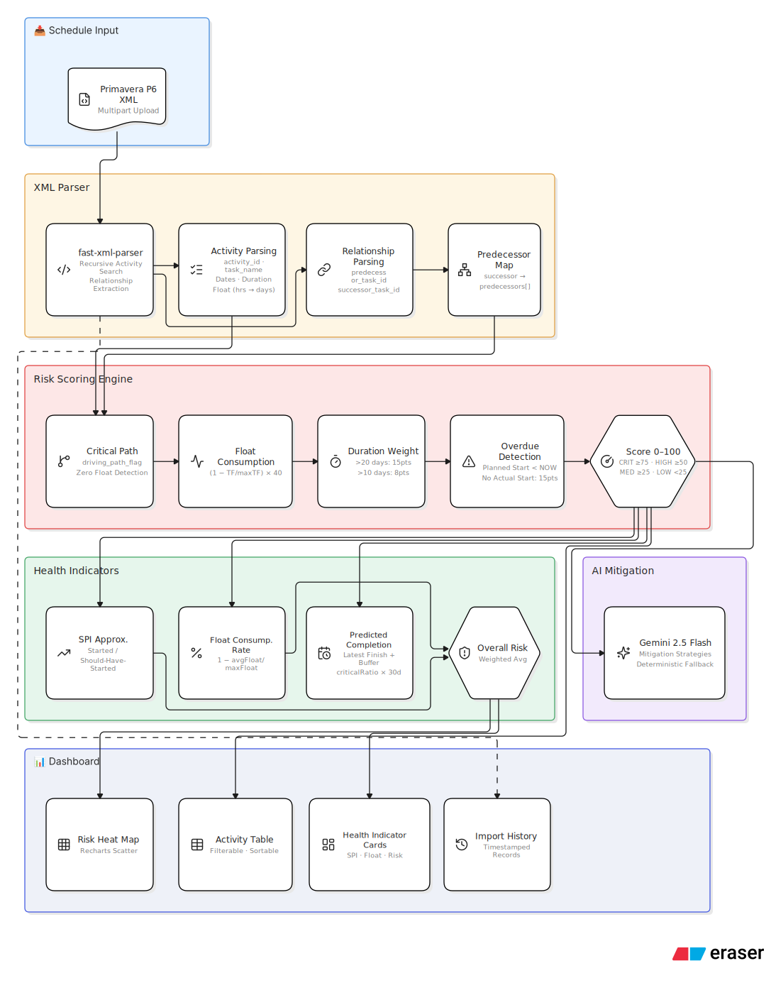

## Application Walkthrough (Screenshots)

### Dashboard


### Authentication


### Team & Members


## Tech Stack

- **Frontend:** Next.js 15.x, React 19.x, TypeScript, TailwindCSS, shadcn/ui, Redux Toolkit, Recharts.
- **Backend:** Node.js 20.x, Express.js, TypeScript, Prisma, Zod, BullMQ.
- **AI:** LangChain.js, LangGraph.js, Gemini API (2.5 Flash), OpenAI Embeddings.
- **Database:** PostgreSQL (Primary), ChromaDB (Vectors), Neo4j (Graph).
- **Storage:** MinIO (S3-compatible Object Storage).
- **Authentication:** JWT with Role-Based Access Control (RBAC).
- **Deployment:** Docker, Docker Compose, Nginx Reverse Proxy.

## Folder Structure

```text
DCBrain/
├── .ai/                    # Architectural decisions, features, and context
├── ArchitectureDiagrams/   # System architecture SVGs
├── backend/                # Express.js REST API and BullMQ Workers
├── demo-uploader/          # Scripts to seed demo project data
├── frontend/               # Next.js 15 App Router web application
├── project-data/           # Sample EPC PDFs, specs, and site evidence
└── public/                 # Static assets and screenshots
```

## Installation

### Prerequisites
- Node.js 20.x
- Docker & Docker Compose
- API Keys: Gemini API, OpenAI API

### Clone
```bash
git clone https://github.com/Nebula/DCBrain.git
cd DCBrain
```

### Environment Variables
Duplicate the environment examples and populate your keys:
```bash
cp backend/.env.example backend/.env
cp frontend/.env.local.example frontend/.env.local
```

### Run (Development)
```bash
# Terminal 1: Backend
cd backend && npm install && npm run dev

# Terminal 2: Frontend
cd frontend && npm install && npm run dev
```

## Docker

DCBrain is fully containerized for simplified orchestration.
```bash
docker compose up -d
```
This spins up the Next.js frontend, Express backend, BullMQ worker, PostgreSQL, Redis, ChromaDB, MinIO, and Neo4j.

## Deployment

The production deployment strategy relies on horizontal scaling and NGINX load balancing.

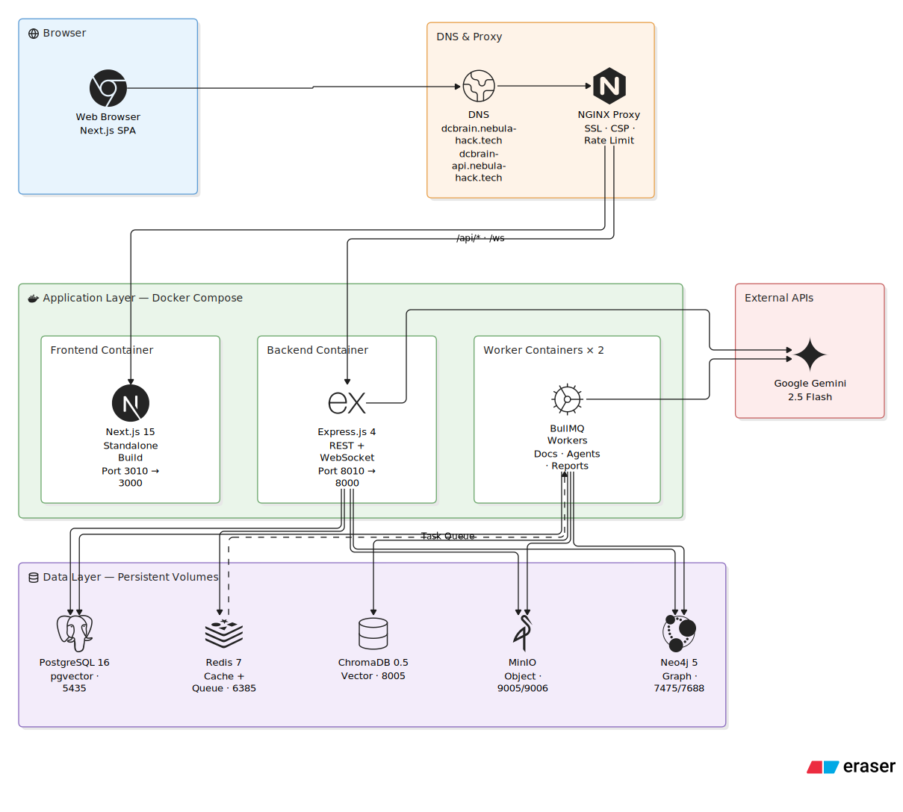

## Project Workflow

1. **Ingestion:** Users upload EPC documents (PDF, DOCX) via the frontend.
2. **Processing:** BullMQ workers trigger Tesseract OCR (if needed), chunk text, and compute embeddings.
3. **Graph Extraction:** Gemini parses entities from documents, mapping them into Neo4j.
4. **Retrieval:** Users query the system; the Supervisor agent routes the request.
5. **Synthesis:** Gemini evaluates retrieved vectors and graph nodes, generating a grounded response with direct citations.
6. **Proactive Monitoring:** Background agents continuously analyze schedule imports and compliance rules, surfacing notifications for risks.

## Design Decisions

- **Neuro-Symbolic Approach:** Chose to blend LLM reasoning with deterministic Graph math (Neo4j) to prevent hallucinated schedule delays.
- **Modular Monolith:** Kept API and workers within a cohesive Node.js repository for speed during the prototype phase, while maintaining strict domain separation for future microservice decomposition.
- **Separation of Queues:** BullMQ is leveraged heavily to offload intensive tasks (PDF parsing, embeddings) to prevent API event-loop blocking.
- **Multi-Agent System:** Adopted LangGraph to isolate responsibilities (e.g., Compliance vs Schedule) rather than relying on one massive, slow prompt.

## Roadmap

- **Multi-Project Portfolio View:** Cross-project analytics and resource allocation tracking.
- **BIM Integration:** 3D model viewer and spatial semantic search (e.g., "Show me equipment in Server Hall B").
- **Mobile Application:** Progressive Web App for offline field access and camera integration.
- **Integration Hub:** Direct APIs for Procore, Aconex, and Microsoft Teams.

## Contributors

**Team Nebula** - ET AI Hackathon 2026

## License

This project is licensed under the MIT License.